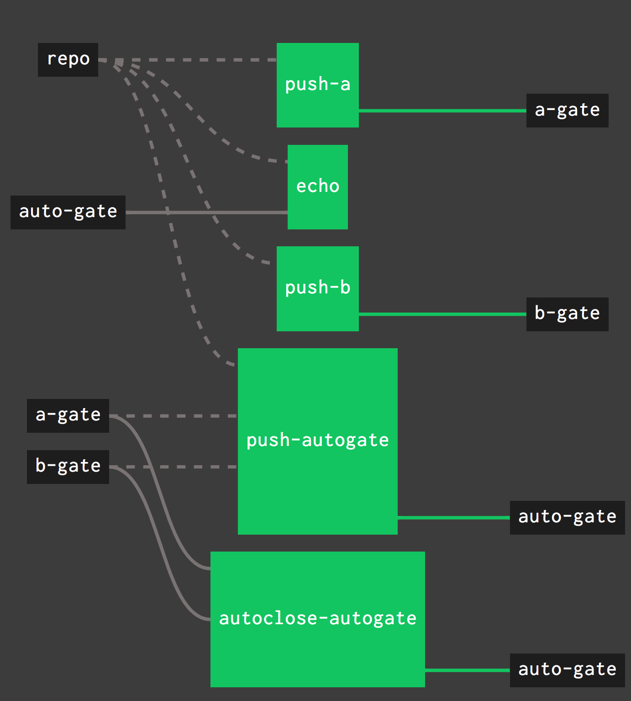

# gate-resource-example

An example pipeline for the [gate resource](https://github.com/Meshcloud/gate-resource).

> The [gates branch](https://github.com/Meshcloud/gate-resource-example/tree/gates) of this repo contains the state of all gates used in this pipeline.

## Gates

This pipeline has the following gates: 

- `a-gate`: a simple gate
- `b-gate`: anoter simple gate
- `auto-gate`: an auto-gate with items that automatically close when a combination of items passed through gates `a` and `b`

## HowTo & Jobs

This example pipeline has the following jobs. To see an example flow, trigger the jobs in the same order as they are described below.

> In a real pipeline, job triggers would of course come from some other source, e.g. a completed build step or a changed source repository.

- `push-a` generates a random item passing through `a-gate`
- `push-b` generates a random item passing through `b-gate`
- `push-autogate` generates an autoclose item in `auto-gate` that depends on the last two item that passed through `a-gate` and `b-gate` respectively
- `autoclose-autogate` updates the autoclose items in `auto-gate`
- `echo` triggers for every item passing through `auto-gate` and simply prints its contents

